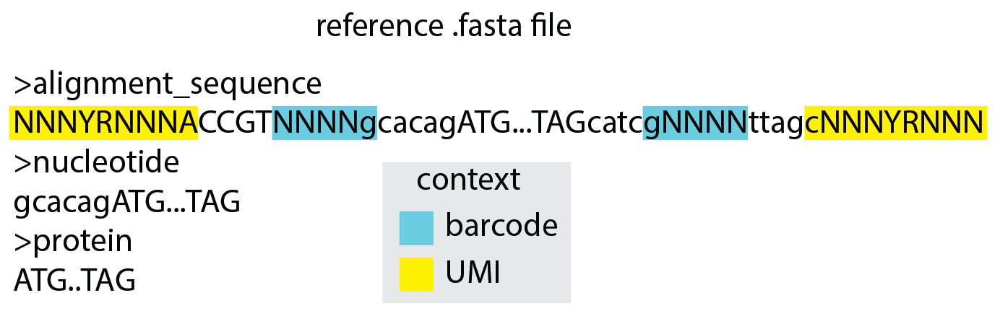

# Maple: Mutation Analysis for Parallel Laboratory Evolution


Maple is a [snakemake](https://snakemake.readthedocs.io/en/stable/index.html) pipeline for analysis of
mutation-rich next generation sequencing data from highly parallelized laboratory evolution experiments.
It provides consensus sequence generation using both concatemer- and unique molecular identifiers (UMI)-based
consensus, easy-to-use and versatile demultiplexing, and a suite of analyses and plotting scripts that are all
executed automatically after the user provides some information about the data and executes a single command.

Analysis is primarily performed by a mix of custom python scripts and several external tools:
 - [medaka](https://github.com/nanoporetech/medaka)
 - [minimap2](https://doi.org/10.1093/bioinformatics/bty191)
 - [Samtools](http://www.htslib.org/)
 - [NGmerge](https://github.com/harvardinformatics/NGmerge)
 - [NanoPlot](https://github.com/wdecoster/NanoPlot)
 - [C3POa](https://github.com/christopher-vollmers/C3POa)
 - [PaCMAP](https://github.com/YingfanWang/PaCMAP)

Built in visualizations are performed using the [HoloViz](https://holoviz.org/) ecosystem of python data visualization libraries.

Additionally, some concepts and code are borrowed from the snakemake pipeline [Nanopype](https://nanopype.readthedocs.io/en/latest/), which was used
as a starting point for Maple

Note that documentation is still under construction

Below you'll see an overview of the steps involved in the pipeline. Note that many of these steps are optional, and which ones
run will depend on what information is provided in the config file (see 'Usage')


## Setup

Maple has only been tested on Linux, but should also work on MacOS. Maple requires conda, which can be installed by following
[these instructions](https://docs.conda.io/projects/conda/en/latest/user-guide/install/). Miniconda is lighter weight and provides all that is needed by Maple.

Additionally, the following software packages are required as system-wide installations:
 - git gcc g++ wget rsync
 - binutils autoconf make cmake
 - git-lfs
 
These are likely already present in most production environments.

for MacOS users, OpenMP must be installed. As per instructions from [here](https://mac.r-project.org/openmp/), OpenMP can be installed
into the proper `usr/local/lib` and `usr/local/include` locations by typing this into terminal:

```
curl -O https://mac.r-project.org/openmp/openmp-14.0.6-darwin20-Release.tar.gz
sudo tar fvxz openmp-14.0.6-darwin20-Release.tar.gz -C /
```

If you want to retrieve sequences using Illumina's basespace, install and authenticate basespace using [these instructions](https://developer.basespace.illumina.com/docs/content/documentation/cli/cli-overview)

To get started installing Maple, clone the repository:

    git clone https://github.com/gordonrix/maple.git
    cd maple


Create a conda environment that enables usage of mamba, which is better capable of creating environments
with snakemake:

    conda create mamba -n mambaEnv -c conda-forge


Alternatively, with root privileges, mamba may instead be installed in the base environment to reduce package redundancy:

    conda install mamba -n base -c conda-forge


Next, use mamba to create the environment that we need. If using mamba within its own environment, the path to the environment should
be specified with the `--prefix` flag. In this example, the default path prefix ~/miniconda3/envs is used, but please ensure this is the correct location:

    conda activate mambaEnv
    mamba env create --prefix ~/miniconda3/envs/maple --file requirements.yaml
    conda deactivate
    conda activate maple


The various tools that maple uses that are not simple python scripts must now be installed. This is done 
via snakemake, using the `install.smk` snakemake module.
Running the following command, with the `--directory` flag modified to point to same location used for the `--prefix` flag 
in the previous step will finish the installation process by carry out all the steps to providing the environment with program binaries
needed for execution of the pipeline:

    snakemake --snakefile rules/install.smk --directory ~/miniconda3/envs/maple -j 4 all

## Usage

Snakemake needs to know where two files are located in order to run the pipeline: the snakefile and the config file. Generally, the Snakefile tells snakemake how to construct all the necessary files generally for all Maple analyses, while the config file tells Snakemake how to retrieve inputs and name outputs for a specific Maple analysis, and is the primary means by which the user controls the analysis that is performed. If Snakemake is not told where these two files are, it assumes they are in the current working directory. Because the Snakefile remains constant across analyses, while the config file (described further below) changes, the Snakefile typically remains in the Maple directory and is specified in the command line call to Snakemake, while the config file is copied to a new working directory for each analysis and the command line call is done in that directory, allowing Snakemake to find it without adding the path to the command line call. When all inputs are properly defined and the Snakemake command is issued, analysis proceeds autonomously, outputting files to the working directory as they are generated. As an example, if a config file is set up to include a run tag named 'example', the inputs and outputs file structure might
look something like this:

```bash
├── config.yaml
├── ref
│   ├── 7merBarcodes.fasta
│   ├── barcodeGroups.csv
│   ├── exampleReferences.fasta
│   ├── lineageBarcodes.fasta
│   ├── timepoints.csv
│   └── example-ref.fasta
├── data
│   └── expt
│       └── sample
│           └── 20220827_1323_MN35267_FAU75463_1d527443
│               └── fastq_pass
│                   └── 10000seqs.fastq.gz
│                                                    INPUTS
│──────────────────────────────────────────────────────────
│                                                   OUTPUTS
├── sequences
│   ├── RCA
│   │   └── example_RCAconsensuses-nofilter.fasta.gz
│   ├── example.fastq.gz
│   └── UMI
│       ├── example_all_UMIgroup-distribution.csv
│       ├── example_noConsensus.log
│       ├── example-temp
│       │   └── batch0.fasta
│       ├── example_UMIconsensuses.fasta.gz
│       ├── example_UMIconsensuses.log
│       ├── example_UMI-extract.csv
│       └── UMI-extract-summary.csv
├── alignments
│   ├── example.bam
│   ├── example.bam.bai
│   └── example.log
├── demux-stats.csv
├── demux
│   ├── no_subsequent_analysis
│   │   ├── example_bc1-fail.bam
│   ├── example_control.bam
│   ├── example_control.bam.bai
│   ├── example_demux-stats.csv
├── enrichment
│   ├── example_enrichment-scores.csv
│   └── example_enrichment-scores-mean.csv
├── mutation-stats.csv
├── mutation_data
│   └── example
│       ├── control
│       │   ├── example_control_AA-hamming-distance-distribution.csv
│       │   ├── example_control_AA-mutation-distribution.csv
│       │   ├── example_control_AA-mutation-frequencies.csv
│       │   ├── example_control_alignments.txt
│       │   ├── example_control_failures.csv
│       │   ├── example_control_genotypes.csv
│       │   ├── example_control_NT-hamming-distance-distribution.csv
│       │   ├── example_control_NT-mutation-distribution.csv
│       │   ├── example_control_NT-mutation-frequencies.csv
│       │   └── example_control_seq-IDs.csv
├── plots
│   ├── timepoints
│   │   ├── example-IE5_AA-hamming-distance-distribution.html
│   │   ├── example-IE5_AA-mutation-distribution.html
│   │   ├── example-IE5_mutation-distribution-violin.html
│   │   ├── example-IE5_NT-hamming-distance-distribution.html
│   │   └── example-IE5_NT-mutation-distribution.html
│   ├── example_AA-hamming-distance-distribution.html
│   ├── example_AA-mutation-distribution.html
│   ├── example_AA-mutation-frequencies-common.html
│   ├── example_AA-mutation-frequencies.html
│   ├── example_AA-mutation-frequencies-rare.html
│   ├── example_demux.html
│   ├── example_enrichment-scores.html
│   ├── example_mutation-distribution-violin.html
│   ├── example_mutation-rates-heatmap.html
│   ├── example_mutation-rates-mut-grouped.html
│   ├── example_mutation-rates-sample-grouped.html
│   ├── example_NT-hamming-distance-distribution.html
│   ├── example_NT-mutation-distribution.html
│   ├── example_NT-mutation-frequencies-common.html
│   ├── example_NT-mutation-frequencies.html
│   ├── example_NT-mutation-frequencies-rare.html
│   ├── example_RCA-distribution.html
│   └── UMI-group-distribution.html
├── log
    ├── 20221113_18_41_16_275554.maple.log
    └── RCA
        ├── example_RCA.log
        └── example_RCA-log.csv
```

## Inputs and outputs

Maple will generate a number of plots and corresponding data files depending on the inputs that are provided. These inputs and their effect on the resulting pipeline outputs are described below.

### Config

A .yaml file that includes all settings a user might want to change from run to run, and is required, as it is the central point of command for Maple. A portion of this config file is devoted to global settings that will
be applied to all datasets analyzed using this config file, while another portion is used to designate information specific to each dataset being analyzed,
organized by 'tags' which will be applied to all filenames. Detailed information on these settings can be found as inline comments within example_working_directory/config.yaml.

### Reference sequence



A .fasta file that is required and contains either two or three reference sequences. The first sequence is used for pairwise alignment of all reads and
should contain Ns for known variable sequences such as barcodes or UMIs. The second sequence is used to define the range of the reference sequence in which 
nucleotide mutations will be counted and should be a subsequence of either the first sequence or the reverse complement of the first sequence.
The third sequence is used to define the range of the reference sequence in which amino acid mutations will be counted and should be a subsequence of the second
sequence. If the third sequence is not provided, amino acid mutations will not be tabulated.

### High throughput sequencing data

.fastq.gz files. Typically, reads are retrieved using the global `sequences_dir` and `fastq_dir` parameters, which define where sequences are typically stored,
and the tag-specific `runname` parameter, which is a uniquely named directory within `sequences_dir` that contains the .fastq.gz files for a specific run.
In the example_working_directory, the `sequences_dir` is set to `data`, the `fastq_dir` is set to `fastq_pass, fastq_fail`, and the tag-specific runname is set to
`20220827_1323_MN35267_FAU75463_1d527443`, so Maple will crawl the data directory to find the `20220827_1323_MN35267_FAU75463_1d527443` directory, then look for
folders within that directory named `fastq_pass` and `fastq_fail`, and finally look for .fastq.gz files within those directories. As the first step of Maple,
all such .fastq.gz will be combined for subsequent analysis. Alternatively, if merging of paired end reads is necessary, the `fwdReads` and `revReads` parameters
must be provided, and these must correspond to paired end fastq.gz files that can be found in the fastq_dir and should be merged. Note that the `sequences_dir` can be
a global file path. It is recommended that a single directory be used for all sequencing data, and that the `sequences_dir` be set to this directory in the config file,
such that the `sequences_dir` parameter need not be changed when different working directories are cloned using this config file.

# Running the example
Included in the github repository is an example_working_directory that will allow you to test that everything was properly installed, and will serve as a
jumping off point for future working directories. To test that everything is working, navigate to this working directory and perform a 'dry-run' (`-n`) for 
all files that are demanded by the `targets` directive to see that snakemake knows how to perform all the required steps.
Here we also include the `-q` or `--quiet` flag so that any warnings that might come up don't require much scrolling to get to. Finally, the `-j 4`
flag is used to designate that 4 threads can be used. When more threads are provided, most steps of the pipeline will run faster, so increase this number
as appropriate:

    snakemake --snakefile ../Snakefile -j 4 targets -n -q

This should produce some gold text that shows all the different jobs that will be run. Running the same command without the extra flags will run all the rules:

    snakemake --snakefile ../Snakefile -j 4 targets

If this worked, you will see a stream of green text describing the steps that are being performed, followed by the text
    maple completed successfully

You can then explore the analysis files that have been created, and/or apply this same process to your own data.

# Running maple on your data

Following installation and running the example, the steps required for basic usage of the pipeline are as follows:
1. Create a directory for the dataset(s) that you wish to analyze by creating a new working directory with the name of your choice (preferably related to
a specific experiment) and copy the 'ref' directory and 'config.yaml' file from the example_working_directory to this new directory.
2. Modify the config.yaml file within the new directory as appropriate. Global settings (applied to the working directory using this config file) come after
the 'runs' key. Most global settings can be kept as default, but pay special attention to the RCA and UMI settings if require consensus sequence generation.
In contrast, most of the settings for the 'tag'(s) you are analyzing should be changed, such as the sequencing data type/location and the
different required inputs for different types of analysis that should be performed (e.g. concatemer/UMI consensus, demultiplexing).
3. Modify the reference sequence and barcode .fasta files (located in the 'ref' directory) as appropriate. Use the exampleReferences.fasta file
for assistance with determining the appropriate reference sequences.
4. Activate the maple conda environment that you created during installation if it's not already active, and run snakemake by requesting a specific file,
and designating a number of threads. In most cases, at least 4 threads should be used. Take care to run the pipeline only when in the working
directory (e.g. example_working_directory), otherwise the --directory flag must be used to specify a directory that contains the appropriate
files in the correct relative locations (i.e. config.yaml, ref/*, etc.). The path to the maple snakefile must also be modified as appropriate.
Here I will ask maple to produce the mutation stats summary file for the TrpB tag, which is defined in the config file:

    conda activate maple
    snakemake --snakefile PATH/TO/maple/Snakefile -j 4 TrpB_mutation-stats.csv

Use of the '-n' flag is strongly recommended prior to running the full pipeline. This causes snakemake to do a 'dry-run' in which jobs are planned out, but
not executed. Because many checks are performed to identify any potential problems in how things were set up (e.g. checking that reference files
exist), this will better guarantee that the entire pipeline will run to completion prior to starting it. The '-q' flag should also be used so
that any warnings can be easily read.

In place of a specific file name, 'targets' can be used to invoke a rule that automatically carries out most of the analysis that maple can do
for each of the designated tags, as was done above:

    snakemake --snakefile PATH/TO/maple/Snakefile -j 4 targets

Likewise, if you'd like to restart your analysis without cluttering your working directory with additional tags, or if you just want to package up the key analysis files
for transfer or storage, the 'clean' rule can be called. This will move or copy all the small files generated during analyses to a timestamped directory
and removes large files such as alignment files, without modifying large important files such as .fast5 files and .fastq files. If analysis rules that
produce files in the 'sequences' directory need to be rerun, such as UMI rules or paired end merging, the outputs of those rules must be manually deleted or renamed
to enable rule re-run.

    snakemake --snakefile PATH/TO/maple/Snakefile -j 4 clean


# Running the dashboard


Maple provides an interactive dashboard to enable exploration of very large sequence datasets using a GUI.
This is accomplished using [HoloViz](https://holoviz.org/) visualization libraries, in particular [Panel](https://panel.holoviz.org/).
Unlike with other plots generated by maple, in which all the data necessary for visualization is contained within an .html file that
can be opened and viewed on a browser, the dashboard is responsive to user interaction with a wide range of widgets to control the
data and aesthetic properties of the plots. This requires an active python process that continuously monitors these widgets and recomputes
the visualizations when relevant widgets are changed.

The primary point of control for the dashboard is the points plot, which uses the output of the [PaCMAP](https://github.com/YingfanWang/PaCMAP)
dimensionality reduction algorithm to separate/cluster sequences according to differences/similarities in the mutations they contain. User-selected
points (representing sequences) in this plot will be reflected in other plots, allowing for analysis of specific sequences in isolation.

The data input for the dashboard is a `genotypes-reduced-dimensions.csv` file. The specific file chosen will depend on the `dashboard_input`
parameter in the config file, such that if `dashboard_input == file-prefix` then `file-prefix_genotypes-reduced-dimensions.csv` will be used
as the input. A good starting point is to just use a run tag, which will show all sequences for that tag and allows for coloring by barcode group.
Once the `dashboard_input` parameter is properly set, the dashboard script can be run using the command:

    snakemake --snakefile PATH/TO/maple/Snakefile -j 1 run_dashboard

